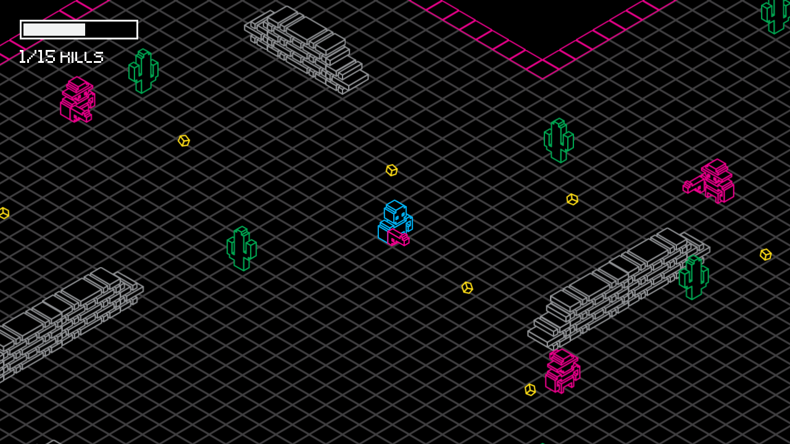
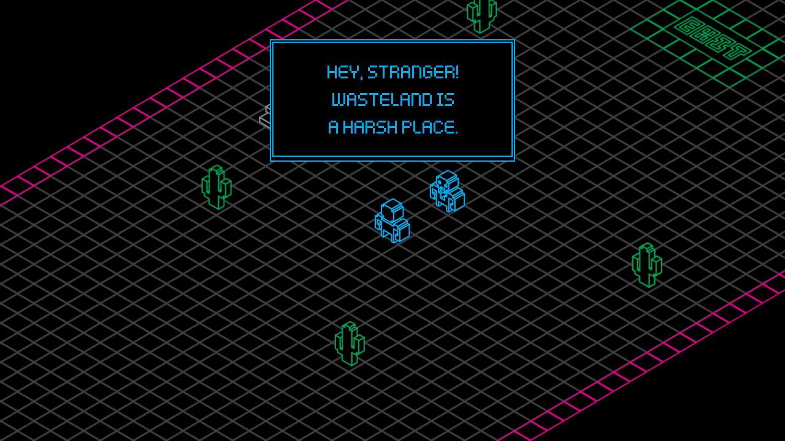
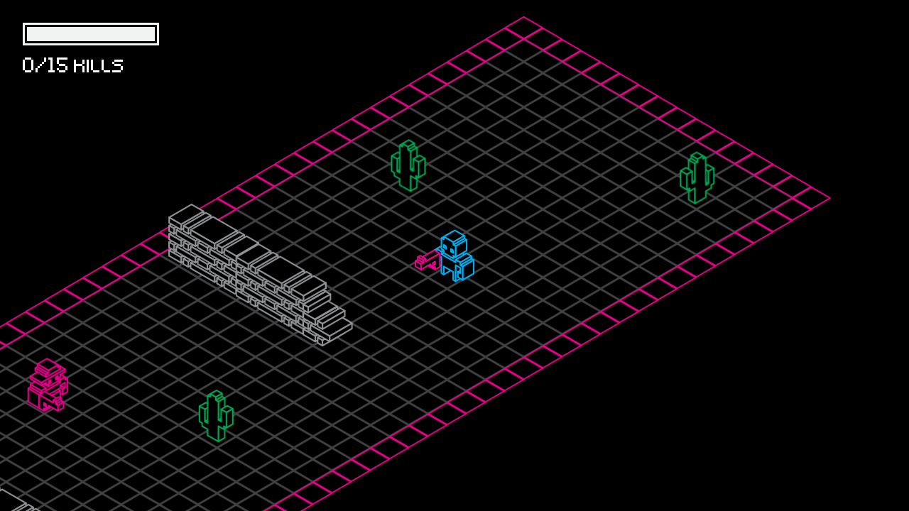

# Miz Jam 1 - Neon Desert
Welcome to my game entry for Miziziziz's Game Jam! This project is a 48-hour implementation of my game **Neon Desert** using the Godot Engine.

## About the Game
**Neon Desert** is an isometric shooter arcade game inspired by the vibrant aesthetics of the '80s, featuring neon lights and a retro vibe.

## Gameplay
In each stage, players navigate through the desert from an isometric perspective, with the primary goal of defeating every enemy encountered.

## Development
This is my first Game Jam, and I developed this game solo in just 48 hours for Miz Jam 1. The game utilizes the Jam Art Kit, specifically the 1-Bit Pack by Kenney. It was created using the Godot Engine 3.2.1.

## Controls
- **[Left Mouse Button]**: Movement
- **[Right Mouse Button]**: Shoot

## Screenshots

## Video
- [Watch the Gameplay Video](https://www.youtube.com/watch?v=Fklt37jx10E)
- [Watch the Game's Development Process Video](https://www.youtube.com/watch?v=d-WW0sU6xpY)

## Links
- **Play in Browser & Download**: [https://ggbot.itch.io/neon-desert](https://ggbot.itch.io/neon-desert)
- **Submission Page for Miz Jam 1**: [https://itch.io/jam/miz-jam-1/rate/735142](https://itch.io/jam/miz-jam-1/rate/735142)
- **Official Game Jam Page**: [https://itch.io/jam/miz-jam-1](https://itch.io/jam/miz-jam-1)
